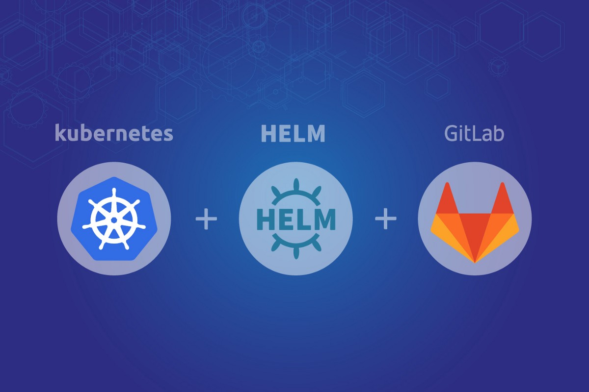

__Centralized Pipelines on Gitlab__
================================

Creation of centralized pipelines for Java, React based applications 

Basic settings
------------
* Template jobs for Pipeline (for mono-repo / multi-module projects)
* Included python script for generation dynamic pipeline for multi-module projects
* Helm Charts (Added to the deploy folder inside each project)
* Used jib and kaniko to build and push images to gitlab registry
* Demo projects are java, react type projects. (The demo projects do not belong to me, only the CI and CD side)

Gitlab + Helm + Kubernetes
------------


Note
------------
You can add variables in Gitlab at the group level from Settings -> CICD -> Variables

```
* CI_REGISTRY_USER: registry_user
* CI_REGISTRY_PASSWORD: password
* CI_GITLAB_USERNAME: cicd_user
* CI_GITLAB_PASSWORD: password
* CI_K8S_CONFIG_DEV: (included dev Cluster kube config)
* CI_K8S_CONFIG_PROD: (included prod Cluster kube config)
```

Stages designed for mono projects:

```
stages:
  - test
  - release
  - deploy
```

Stages designed for multi-module projects:

```
stages:
  - generate-child-pipeline
  - trigger-child-pipeline
```

Stages of the new pipeline after the execution of the script in the previous pipeline:

```
stages:
  - test
  - release
  - deploy-dev
  - deploy-prod
```

.gitlab-ci.yml
------------
* Each demo repo must contain a .gitlab-ci.yml file
* The template pipeline file must be included from the central repo 

```
include:
 - project: devops/cicd-template
   file: "gitlab-ci-template.yml"
```

* Variables with True or False values appropriate to the project type.

```
variables:
  CI_PROJECT_TYPE_FRONTEND: "FALSE"
  CI_PROJECT_TYPE_BACKEND: "TRUE"
  #----------------------------------
  CI_PROJECT_MODE_MONO_REPO: "TRUE"
  CI_PROJECT_MODE_MULTI_MODULE: "FALSE"
  #----------------------------------
  CI_APPLICATION_TYPE_MAVEN: "FALSE"
  CI_APPLICATION_TYPE_GRADLE: "TRUE"
  #----------------------------------
  CI_RELEASE_TYPE_JIB: "TRUE"
  CI_RELEASE_TYPE_KANIKO: "FALSE"
```

Helm Charts
------------
* The Values file is designed for two branches (Develop / Master)
* When configmap and secretes are enabled, they are automatically set to the deployment file in the template
* The TLS have been set up at the Istio gateway (Certificates must be attached in base64 format)
* Consideration of multiple routing in Istio Gateway Virtualservice
* Settings for certificates and secrets in Values files, generation of certificates and secrets are suitable for non-automated environments

__Requirements__
------------
* Gitlab
* Kubernetes
* Helm
* Python

__Author Information__
------------------

Samir Nabadov
